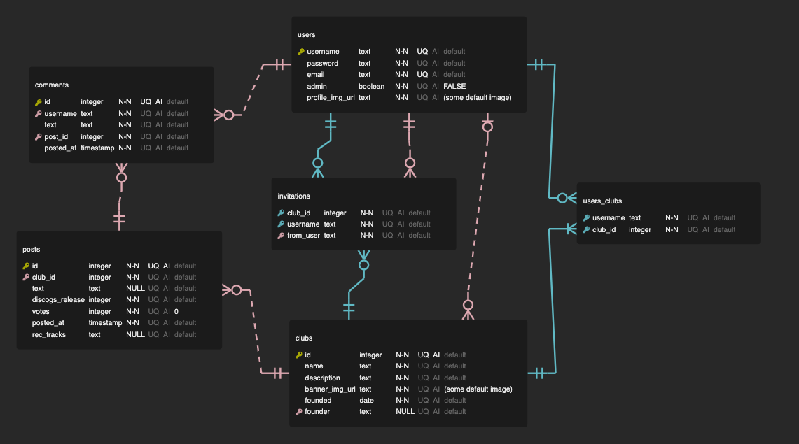

1. What tech stack will you use for your final project?

    Frontend: React + React Router

    Backend: Express, PostgreSQL

2. Is the front-end UI or the back-end going to be the focus of your project? Or are you going to make an evenly focused full-stack application?

    I believe this will be an evenly focused application. I want this to have a clean and easy-to-use UI, preferably as a single-page app with React Router. And I think there are potentially some interesting things I could do with displaying the clubs and user posts. But the backend will be powering the user-interaction features of the app, such as joining clubs, creating posts and comments, and voting on posts, so it will be very important to the app.

3. Will this be a website? A mobile app? Something else?

    This will be a website.

4. What goal will your project be designed to achieve?

    The goal of this project is to create an easy way to share music recommendations with friends, outside of platforms like Spotify or Apple Music. Users create "clubs" that they can invite their friends (who have accounts) to. Then, any user in that club can post recommendations for albums or singles that they think other users in the group should listen to. The other members of the club can comment and upvote or downvote each recommendation. The result is, ideally, a "music club", where you're sharing music with your friends and interacting with their recommendations. Users will be able to find exciting new music to listen to via their friends' recommendations. Users will be able to join multiple clubs, also, if they'd like!

5. What kind of users will visit your app? In other words, what is the demographic of
your users?

    Anyone who loves music can visit my app, and I know music lovers of all ages! That being said, people who are actively seeking out new music tend to be somewhere from teenagers to age 35 according to data, so it's probable that my app would be used mostly by teenagers and younger adults. 

6. What data do you plan on using? How are you planning on collecting your data?
You may have not picked your actual API yet, which is fine, just outline what kind of data you would like it to contain.

    The data I plan to use will come from a database of music releases (right now, planning on using Discogs.com). The data I need on each release for a user to post a recommendation is not too in-depth - at minimum, the artist who made it and the title of the album or song. Ideally, with an image of the album cover art, the year of release, and a genre. I don't need the API to provide a link to listen to it at the moment, as the app is not intended for the user to actually listen to this music via the app, just get a recommendation for something to listen to in their medium of choice. And even if I did, it's possible this would not need to come from an API, the user could insert their own link.

7. In brief, outline your approach to creating your project (knowing that you may not
know everything in advance and that these details might change later). Answer questions like the ones below, but feel free to add more information:
    1. What does your database schema look like?

        

        Tables:

        - users
            - Tracking all user data
            - username
            - password (Stored as a hash)
            - email (Not used in minimum viable, but I'd like to have it on file for future features)
            - admin (Is the user an admin or not?)
            - profile_img_url (Users will all get profile images to identify their posts)
        - clubs
            - Stores info about each club
            - id
            - name
            - description
            - banner_img_url (Each club will display a banner at the top as an identifying image)
            - founded (The date a club was founded on)
            - founder (References users)
        - users_clubs
            - Relationship table linking users to the clubs they belong to
            - username (References users)
            - club_id (References clubs)
        - invitations
            - Table tracking invitations from one user to another to join their club
            - username (The invited user, references users)
            - club_id (References clubs)
            - from_user (The user who invited, references users)
        - posts
            - "Posts" are the recommendation posts users will make in a club
            - id
            - club_id (Which club the post was in, references clubs)
            - text (The body of the post if the user added one)
            - discogs_release (A reference number to the id of the release in the discogs database, to get info about the music being recommended. This could change if my API changes)
            - votes (Tracking the number of votes the post has in the club - this can be a negative number if only/mostly downvotes!)
            - posted_at (Time of post)
            - rec_tracks (An optional set of recommended tracks, typed in by the user)
        - comments
            - Comments on individual posts
            - id
            - username (the user commenting, references users)
            - text (the body of the comment)
            - post_id (the post that the comment is on, references posts)
            - posted_at (Time of post)

    2. What kinds of issues might you run into with your API? This is especially
  important if you are creating your own API, web scraping produces
  notoriously messy data.

        I'm not anticipating many issues with this API, as it's a database of music releases which is what I'm pretty sure I want. The authorization looks like it might be a little trickier than some other APIs I've worked with, though, so I'll have to make sure I figure out a good way to implement that in my app.

        The only other concern I have about this API is that it's album-focused, and my users might want to recommend individual songs. I'll have to make it clear that you need to recommend albums. Actually, I just decided to allow users to list recommended tracks based on this. I know Discogs will have all of the other data I want, especially genre tags which I really want for organizing recommendations. So, I'm sticking with it for the MVP of this project.

    3. Is there any sensitive information you need to secure?

        User passwords, mainly. I'll collect user emails also but I'm not currently planning on surfacing that information.

        I'll want to hide backend keys also, like a secret key for signing user tokens and the API key for Discogs. I plan on using .env files like we learned to hold these values.

    4. What functionality will your app include?

        - Register and login to your account
        - Create and join music clubs
        - Edit clubs you've founded by changing their banner, name, or description
        - Post recommendations to those clubs
        - View all recommended music in your clubs (stretch goal - filter and sort recommendations)
        - Navigate between different clubs
        - Invite other users to your clubs, and accept invitations from other users to join theirs
        - Click on recommendations for more details
        - Upvote or downvote recommendations
        - Comment on recommendations, and edit and delete your comments
        - Edit your profile picture

    5. What will the user flow look like?

        Basic flow:

        1. Create an account
        2. Create or join (via invitation from another user) a club
        3. Navigate to your club from the nav bar
        4. Post a recommendation
            1. Search for a music release that is from the Discogs database. Users can search by artist and title.
            2. Select the release you were looking for
            3. Add a comment if you would like
            4. Post to the club
        5. Invite people to your club
            1. Click "invite user" from the club page to show the invitation view
            2. Search for usernames from the database
            3. Select a user to invite and send invitation
            4. User on the other end will see a badge in the nav bar indicating they have an invite next time they log in or reload the page.
            5. Click "invites" in the navigation to see a list of all invitations.
            6. Accept or dismiss any invitation in the list.
            7. Any clubs you join will now appear in the navigation.
        6. View recommendations
            1. Main page of a club will have a list of recommendations, showing votes and the number of comments. Click an up or down arrow from this view to upvote or downvote the recommendation.
            2. Click a recommendation to open a detail page for that post. Here, users can see all details on the music, and view and add comments. Users can also delete or edit their existing comments.

    6. What features make your site more than a CRUD app? What are your
stretch goals?

        The user interaction features are what make the site more than a CRUD app. Clubs and posts are largely CRUD-based, but voting and commenting on posts adds another dimension. Inviting and joining clubs also pushes the scope just a little bit beyond CRUD, since I'll need to implement some permissions so that users only see clubs that they've joined.

        My main stretch goal is to expand the features that are based on the music posted in a club. Being able to sort the list of posts by something other than the order they are in would be an easy one - maybe alphabetically, or by year of release. Maybe also filtering them by genre or by who posted them. If I really have time, I'd really like to be able to show some stats about the posts in a club, like how many posts each user has, what genres have been posted, what decades the posts are in, etc. I think that would be a cool bit of analysis to display for groups with a lot of posts.

        The other thing I'm thinking is that I might want to split clubs between private and public - for users who don't have friends using the app, it would be a lonely place if all clubs were private! Because this would require some additional UI, I'm leaving it as a stretch goal for now, but I may end up implementing it just because it will be an easy way to show the functionality of the app in the future.

